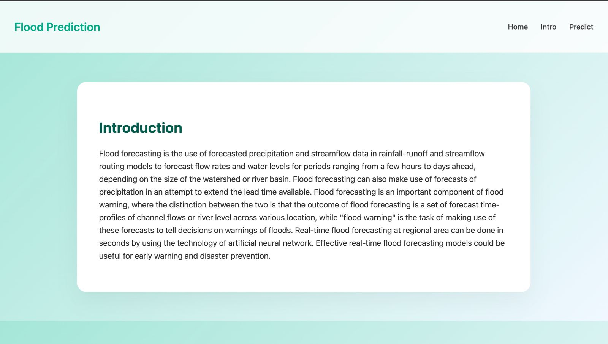
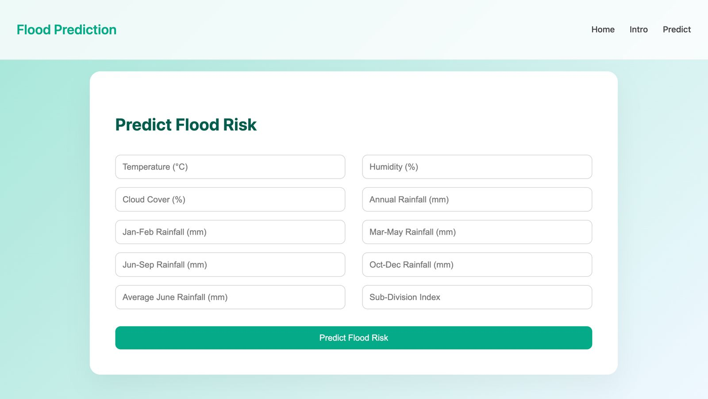
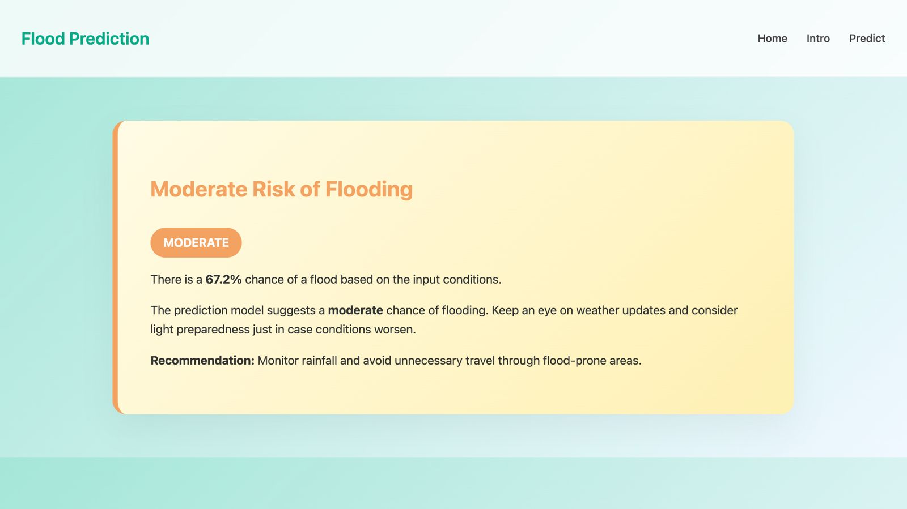

# Rising Waters – Flood Risk Classifier

_A machine learning-powered web app for classifying flood risk based on rainfall patterns_

---

## 📌 Overview

**Rising Waters** is a machine learning project designed to predict flood risk levels based on rainfall and weather distribution patterns. It uses a **Logistic Regression model** to classify user input into **Low**, **Mid**, or **High** flood risk categories, displayed through a clean and simple **Flask web interface**.

> ⚠️ **Note**: Due to project constraints, the model was trained on a **very small dataset (only 115 records)**. Complex models like XGBoost were found to **overfit**, and were replaced with **Logistic Regression** for more generalizable predictions.

---

## ✨ Features

- ✅ Predicts flood risk using user-provided weather inputs
- 🧠 Implements **Logistic Regression** for stability on small datasets
- 💻 Flask-based web application with intuitive risk classification output
- 📈 Risk categories: **Low**, **Mid**, or **High**
- 🎥 [Watch Demo Video](https://drive.google.com/file/d/1s92rOpspIY0mZtdsOUABsVojA3j8i0J4/view)

---

## 🧠 Tech Stack

- **Python**, **pandas**,**numpy**, **scikit-learn**
- **Logistic Regression**
- **Flask** (web framework)
- **HTML/CSS** (for templates and styling)

---

## Project Structure

Rising-Waters/  
├── app/ # Flask application and UI logic  
├── data/ # Raw and processed datasets  
├── models/ # Saved machine learning models  
├── notebooks/ # Jupyter notebooks for EDA and modelling  
├── requirements.txt # Python dependencies  
├── README.md # Project overview  
└── LICENSE # License file

## 🚀 Getting Started

### ✅ Prerequisites

- Python 3.8+
- pip

### 🔧 Installation

```bash
# Clone the repo
git clone https://github.com/ananyagupta17/Rising-Waters.git
cd Rising-Waters

# Install dependencies
pip install -r requirements.txt

```

## 📊 Model Performance (Logistic Regression on Small Dataset)

              precision    recall  f1-score   support

           0       1.00      1.00      1.00        20
           1       1.00      1.00      1.00         3

    accuracy                           1.00        23

macro avg 1.00 1.00 1.00 23
weighted avg 1.00 1.00 1.00 23

# Confusion matrix

[[20  0]
 [ 0  3]]

---

## 📸 Screenshots

> _Explore the user interface of Rising Waters_

| Home Page                            | Introduction Page                      |
| ------------------------------------ | -------------------------------------- |
|  |  |

| Prediction Form                            | Risk Output Page                                 |
| ------------------------------------------ | ------------------------------------------------ |
|  |  |

s
